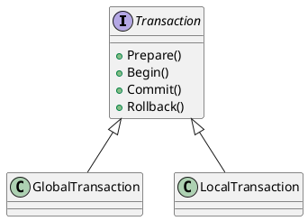
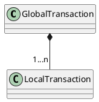
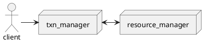
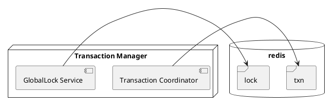
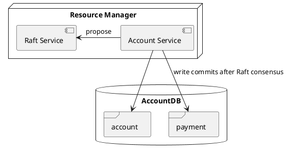
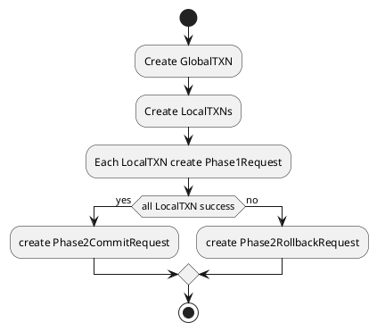
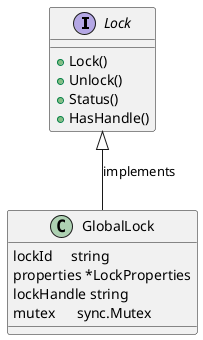
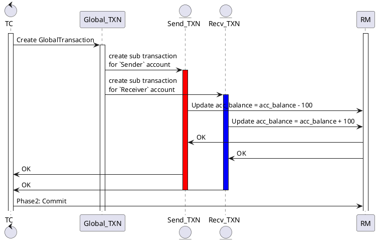
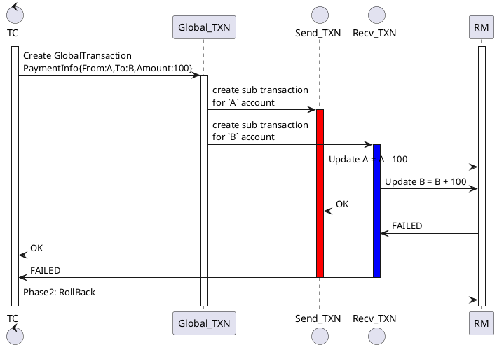

# Mini Account System


# 1. Distributed systems
Given the distributed system, the problem is to make sure the ACID (Atomicity, Consistency, Isolation, Durability) among the cluster nodes.
## 1.1 Raft consensus
This project uses etcd/raft library to implemet the Consistency between nodes [Link](https://godoc.org/github.com/coreos/etcd/raft)

## 1.2 2-Phase Commit
Given the data is sharded between nodes, the problem when a transaction which involving multiple nodes will make sure Atomicity (All-or-nothing).

## 1.3 Multi Raft
`Multi raft` is multiple raft-groups, each `raft-group` includes multiple `raft-nodes`. Each raft-group will be responsible for manage one shard or one partition of data. 


In `Mini Account System`, we will call each raft-group is a bucket which will store a shard of the data of the `account` table.

# 2. Data structutre
Take a example of 3-node cluster. Each node will have 2 buckets work as a bucket for holding a range or part of data of table `account`, each node is a raft-node.

| Node 1       	| Node 2     | Node 3     |
| :------------- | :----------: | -----------: |
|  **bucket_1** | bucket_2  | bucket_3'    |
| bucket_3   | *bucket_1'* | bucket_2' |

Example:
- Each bucket_* is a Raft-node.
- **bucket_1** and *bucket_1'* work in the same Raft-group.

Assigning a data to bucket by:
```
bucket_id := max_id % (num_of_buckets)
```

We have a data structure to keep track buckets in Redis:
| bucket_id       	| peers    |
| :------------- | :----------: |
|  1 | 127.0.0.1:50041,127.0.0.1:50042  |
|  2  | 127.0.0.1:50051,127.0.0.1:50052 |
|  3  | 127.0.0.1:50061,127.0.0.1:50062 |
For example in the picture:
```plantuml
@startuml
node "Transaction Manager" as node1 #white
node "Resource Manager" as node2 {
	frame bucket_1 as A1  #red
	frame bucket_3 as C1 #yellow
}
node "Resource Manager" as node3 {
	frame bucket_1' as A2 #red
	frame bucket_2 as B2 #green
}
node "Resource Manager" as node4 {
	frame bucket_2' as B3 #green
	frame bucket_3' as C3 #yellow
}
node1 --- node2
node1 --- node3
node1 --- node4

A1 .. A2: replicated
B2 .. B3: replicated
C1 .. C3: replicated
@endumls
```
*Noted that for easier we take the example of 3-node, with number of raft nodes per bucket is 2, but for general case we need 5-node cluster because raft nodes needs to be odd number.*

We will have a table to keep track which data is located in which bucket:

| account_id       	| buckets    |
| :------------- | :----------: |
|  1 | 127.0.0.1:50051   |
|  2  | 127.0.0.1:50041 |

So that when a transaction begins, the transaction client will know which peer bucket to talk with based on the account_id.
# 3. Transaction
In **Transaction Coordinator** there are 2 types of object:
## 3.1 Global transation

## 3.2 Local transation
  


# 4. System designs
## 4.1 Components


**`Transaction Manager`** includes 2 services with Redis as the storage:


**`Resource Manager`** includes 2 services with MySQL as the storage for Account data:

## 4.2 Transaction Manager
To achieve Atomicity, we need a Transaction Manager which controls the sub-transactions and also the locking mechanism on the resources.
### 4.2.1 Transaction Coordinator (TC)
TC implements gRPC calls for:
```
CreateAccount(ctx context.Context, in *pb.AccountRequest) (*pb.AccountReply, error)
CreatePayment(ctx context.Context, in *pb.PaymentRequest) (*pb.PaymentReply, error)
```
This is the entry points of the application, providing APIs to create new account and create new payment between accounts.

TC is responsible for managing `GlobalTransaction`, which includes multiple `LocalTransaction`.

When TC receive a `CreatePayment` request, it will create 2 `LocalTransaction` which will send `Phase1Request` to `ResourceManager` to update the data of `Sender` and `Receiver` accounts:

### 4.2.2 GlobalLock Service (GLS)
GLS implements gRPC calls for:
```
AcquireLock(ctx context.Context, in *pb.LockRequest) (*pb.LockReply, error)
ReleaseLock(ctx context.Context, in *pb.LockRequest) (*pb.LockReply, error)
```



To control the lock, follow the code:
```
var lockProperties = &LockProperties{
	LockAttempts:     10,
	LockAttemptDelay: time.Duration(1000 * time.Millisecond),
	LockTimeout:      time.Duration(5000 * time.Millisecond),
}

lockCtl := NewLockController(in.LockId, lockProperties)

var message string
if stt, err := lock.Lock(); !stt || err != nil {
	message = "FAILED"
} else {
	message = "OK"
}
```
First we need to create the lockProperties which holds the configuration of the lock.

Second we need to create a `lock controller` for the given `lockId`.

When calling `lockCtl.Lock()`, the lockController will create a unique key in `Redis`. If other lockController (for the same lockId) also call the Lock() after that, there will be error, they will retry obtaining the lock with the attempts defined in lockProperties object until one of the following cases happens:
- The current lock controller releases the lock (delete the key in Redis)
- The current lock controller timeouts (defined in LockTimeout parameter)

## 4.3 Resource Manager
### 4.3.1 Account Service
### 4.3.2 Raft Service (Raft)

## 4.4 Workflows
### 4.4.1 Create Account
When TC receive a create request from user with AccountInfo:
```
type AccountInfo struct {
	Id      string
	Number  string
	Balance float64
}
```
### 4.4.2 Create Payment
When TC receive a payment request from user with PaymentInfo:
```
type PaymentInfo struct {
	Id     string
	From   string
	To     string
	Amount float64
}
```
TC will create a `GlobalTransaction` object with 2 `LocalTransaction` objects, one to update balance of `Sender` and one to update `Receiver`. Workflow as in the following section.

## Commit case:


## Rollback case:


