# Mini Account System
Some abbreviations used in this document:

- TM: Transaction Manager
- TC: Transaction Coordinator
- GLS: GlobalLock Service
- RM: Resource Manager
- TXN: Transaction

# Table of Contents
- [Mini Account System](#mini-account-system)
- [Table of Contents](#table-of-contents)
- [1. Distributed systems](#1-distributed-systems)
	- [1.1 Raft consensus](#11-raft-consensus)
	- [1.2 Two-Phase Commit (2PC)](#12-two-phase-commit-2pc)
	- [1.3 Multi Raft](#13-multi-raft)
- [2. Data structutre](#2-data-structutre)
- [3. Transaction](#3-transaction)
	- [3.1 Global transation](#31-global-transation)
	- [3.2 Local transation](#32-local-transation)
- [4. System designs](#4-system-designs)
	- [4.1 Components](#41-components)
	- [4.2 Transaction Manager](#42-transaction-manager)
		- [4.2.1 Transaction Coordinator (TC)](#421-transaction-coordinator-tc)
		- [4.2.2 GlobalLock Service (GLS)](#422-globallock-service-gls)
	- [4.3 Resource Manager](#43-resource-manager)
		- [4.3.1 Account Service](#431-account-service)
		- [4.3.2 Raft Service (Raft)](#432-raft-service-raft)
		- [4.3.3 Propose Changes](#433-propose-changes)
		- [4.3.3 Commit Changes](#433-commit-changes)
		- [4.4 Data Access Objects (DAO)](#44-data-access-objects-dao)
	- [Starting servers:](#starting-servers)
		- [Start Transaction Manager:](#start-transaction-manager)
		- [Start Resource Manager:](#start-resource-manager)
		- [Add RM to cluster](#add-rm-to-cluster)
	- [4.5 Workflows](#45-workflows)
		- [4.4.1 Create Account](#441-create-account)
		- [4.5.2 Create Payment](#452-create-payment)
	- [Commit case:](#commit-case)
	- [Rollback case:](#rollback-case)
	- [Write Locking](#write-locking)
		- [Trường hợp commit](#tr%C6%B0%E1%BB%9Dng-h%E1%BB%A3p-commit)
		- [Trường hợp rollback](#tr%C6%B0%E1%BB%9Dng-h%E1%BB%A3p-rollback)
	- [Read Locking](#read-locking)
		- [Read-Uncommitted](#read-uncommitted)
- [5. API Authentication](#5-api-authentication)
	- [5.1 TLS](#51-tls)
	- [5.2 JWT](#52-jwt)
	- [5.3 Enable TLS and JWT in Server](#53-enable-tls-and-jwt-in-server)
	- [5.4 Make a request to TC](#54-make-a-request-to-tc)
	- [5.4 Register JWT Token for new account](#54-register-jwt-token-for-new-account)
- [6. Deployment](#6-deployment)
	- [Các vấn đề chưa, sẽ giải quyết](#c%C3%A1c-v%E1%BA%A5n-%C4%91%E1%BB%81-ch%C6%B0a-s%E1%BA%BD-gi%E1%BA%A3i-quy%E1%BA%BFt)
	- [Known issues:](#known-issues)
	- [Tài liệu tham khảo:](#t%C3%A0i-li%E1%BB%87u-tham-kh%E1%BA%A3o)
	- [Appendix A: Raft cluster configuration](#appendix-a-raft-cluster-configuration)
	- [Appendix B: TODO: Redistribute (rebalance) Data khi add/remove node](#appendix-b-todo-redistribute-rebalance-data-khi-addremove-node)
	- [Install RocksDB on MacOS](#install-rocksdb-on-macos)
	- [Making Dockerfile](#making-dockerfile)
  
# 1. Distributed systems
Given the distributed system, where each service has its own Database system, the problem is to make sure the ACID (Atomicity, Consistency, Isolation, Durability) of a transaction between data among the cluster nodes.
## 1.1 Raft consensus
This project uses etcd/raft library to implement the Consistency between nodes [Link](https://godoc.org/github.com/coreos/etcd/raft)

Raft help to replicate data to other nodes.

**Raft is used to achieve CP.**
## 1.2 Two-Phase Commit (2PC)
Given the data is sharded between nodes, the problem when a transaction which involving multiple nodes will make sure Atomicity (All-or-nothing).

To achieve `Atomicity`, we need to implement a `Transaction Coordinator` to control the transactions of multiple database servers.

**Use 2PC to achieve CA.**
## 1.3 Multi Raft
`Multi raft` is multiple raft-groups, each `raft-group` includes multiple `raft-nodes`. Each raft-group will be responsible for manage one shard or one partition of data. 

In `Mini Account System`, we will call each raft-group is a bucket which will store a shard of the data of the `account` table.

# 2. Data structutre
Take a example of 3-node cluster. Each node will have 2 buckets work as a bucket for holding a different range or part of data of table `account`, each bucket is a raft-node.

| Node 1       |   Node 2    |    Node 3 |
| :----------- | :---------: | --------: |
| **bucket_1** |  bucket_2   | bucket_3' |
| bucket_3     | *bucket_1'* | bucket_2' |

Example:
- Each bucket_* is a Raft-node.
- **bucket_1** and *bucket_1'* belong to the same Raft-group.

When new data incoming, we assign a data to bucket by:
```
bucket_id := max_id % (num_of_buckets)
```
We also store the information of the bucket_id and the corresponding peers in Redis:

| bucket_id |              peers              |
| :-------- | :-----------------------------: |
| 1         | 127.0.0.1:50041,127.0.0.1:50042 |
| 2         | 127.0.0.1:50051,127.0.0.1:50052 |
| 3         | 127.0.0.1:50061,127.0.0.1:50062 |
For example in the picture:
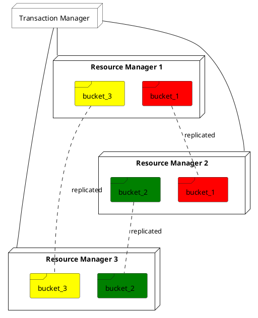
*Noted that for easier we take the example of 3-node, with number of raft nodes per bucket is 2, but for general case we need 5-node cluster because raft nodes needs to be odd number.*

We also have a data structure to keep track which data belong to which buckets, this is stored in Redis:

| account_id |     buckets     |
| :--------- | :-------------: |
| 1          | 127.0.0.1:50051 |
| 2          | 127.0.0.1:50041 |
| ...        |       ...       |

So that when a transaction begins, the transaction client will know which peer bucket to talk with based on the `account_id`.
# 3. Transaction
In **Transaction Coordinator** there are 2 types of object:
## 3.1 Global transation
`Global Transaction` includes multiple `Local Transaction`.
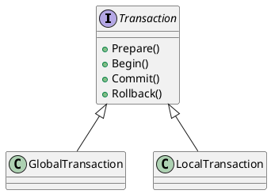
## 3.2 Local transation
Each `Local Transaction` responsible for a single Transaction on a `Bucket` or a `Raft-group`.

For example:
- We want to transfer `$100` from `accountA` (stored in bucket_1) to `accountB` (stored in bucket_2). We will create 2 Local Transaction object, one to send RPC request to `ResourceManager` of `bucket_1` to update accountA - $100 and one to send RPC request to `ResourceManager2` of `bucket_2` to update accountB + $100.
- The status of the Global Transaction is based on status of its Local Transactions.
  
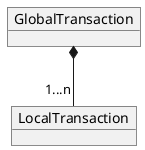

# 4. System designs
## 4.1 Components
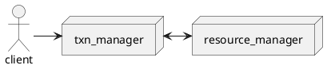

**`Transaction Manager`** includes 2 services with Redis as the storage:
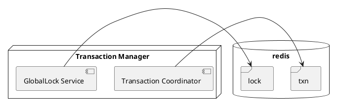

**`Resource Manager`** includes 2 services with MySQL as the storage for Account data:
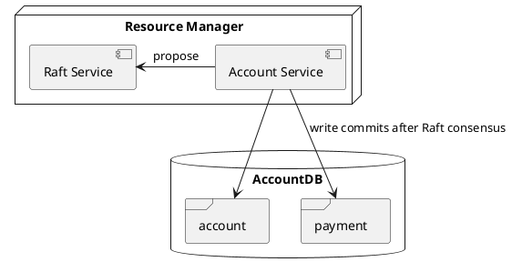
## 4.2 Transaction Manager
To achieve Atomicity, we need a Transaction Manager which controls the sub-transactions and also the locking mechanism on the resources.
### 4.2.1 Transaction Coordinator (TC)
TC implements gRPC calls for:
```
CreateAccount(ctx context.Context, in *pb.AccountRequest) (*pb.AccountReply, error)
CreatePayment(ctx context.Context, in *pb.PaymentRequest) (*pb.PaymentReply, error)
```
This is the entry points of the application, providing APIs to create new account and create new payment between accounts.

TC is responsible for managing `GlobalTransaction`, which includes multiple `LocalTransaction`.

When TC receive a `CreatePayment` request, it will create 2 `LocalTransaction` which will send `Phase1Request` to `ResourceManager` to update the data of `Sender` and `Receiver` accounts:
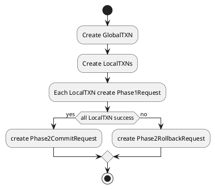
### 4.2.2 GlobalLock Service (GLS)
GLS implements gRPC calls for:
```
AcquireLock(ctx context.Context, in *pb.LockRequest) (*pb.LockReply, error)
ReleaseLock(ctx context.Context, in *pb.LockRequest) (*pb.LockReply, error)
```

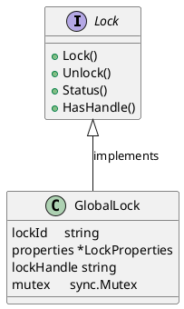

To control the lock, follow the code:
```
var lockProperties = &LockProperties{
	LockAttempts:     10,
	LockAttemptDelay: time.Duration(1000 * time.Millisecond),
	LockTimeout:      time.Duration(5000 * time.Millisecond),
}

lockCtl := NewLockController(in.LockId, lockProperties)

var message string
if stt, err := lock.Lock(); !stt || err != nil {
	message = "FAILED"
} else {
	message = "OK"
}
```
First we need to create the lockProperties which holds the configuration of the lock.

Second we need to create a `lock controller` for the given `lockId`.

When calling `lockCtl.Lock()`, the lockController will create a unique key in `Redis`. If other lockController (for the same lockId) also call the Lock() after that, there will be error, they will retry obtaining the lock with the attempts defined in lockProperties object until one of the following cases happens:
- The current lock controller releases the lock (delete the key in Redis)
- The current lock controller timeouts (defined in LockTimeout parameter)

## 4.3 Resource Manager
Resource Manager is a gRPC server with following methods:
```
ProcessPhase1(ctx context.Context, in *pb.TXRequest) (*pb.TXReply, error)
ProcessPhase2Commit(ctx context.Context, in *pb.TXRequest) (*pb.TXReply, error)
ProcessPhase2Rollback(ctx context.Context, in *pb.TXRequest) (*pb.TXReply, error)
```

When received request, resource manager will decode the object in the message to the Instruction object with the following fields:
```
type Instruction struct {
	Type string
	Data interface{}
}
```

Depends on the type of instuction, the data is different, for example, if the type of instruction is `INS_TYPE_CREATE_ACCOUNT`, then the Data is the `AccountInfo` object, if `INS_TYPE_SEND_PAYMENT` or  `INS_TYPE_RECEIVE_PAYMENT` then the Data field is the `PaymentInfo` object.
### 4.3.1 Account Service
Account Service is responsible for proposing changes to Raft service, when Raft returns the message inform that consensus is done, Account Service will communitcate with GlobalLock Service to acquire the Lock for before committing locally.

Account Service also responsible for Rolling back changes when receives request from TC.

After making changes to DB, Account Service will return status to TC to inform transaction is failed or succeeded.

AccountService interface is defined as below:
```
type AccountService interface {
	Start()
	CreateAccount(string, float64) string
	ProcessSendPayment(string, string, float64) string
	ProcessReceivePayment(string, string, float64) string
	ProcessRollbackPayment(accountNum string, amount float64) string
	Propose(interface{})                      //propose to RaftNode
	ReadCommits(<-chan *string, <-chan error) //read commits from RaftNode
}
```

### 4.3.2 Raft Service (Raft)
When starting ResourceManager, we also start Raft service:
```
clusterInfo := consensus.RaftInit(clusterConfig)
accountDB := db.CreateAccountDB("localhost", "root", "123456", *clusterConfig.DBName)
var accountService rm.AccountService = rm.NewAccountService(accountDB, clusterInfo.CommitC, clusterInfo.ProposeC, <-clusterInfo.SnapshotterReady, clusterInfo.ErrorC)
startServer(accountService, clusterConfig.RPCPort)
```

### 4.3.3 Propose Changes
When `AccountService` wants to make changes in Database, it first send the changes to `proposeC`, a go channel, then `RaftNode_Leader` takes the proposed changes and make consensus with other `RaftNode_Follower*`, when proposed changes are permitted then the change will be sent to `commitC` go channel back to `AccountService`.

Then `AccountService` will call the function `ApplyInstructionToStateMachine` to begin commit data changes to database. 
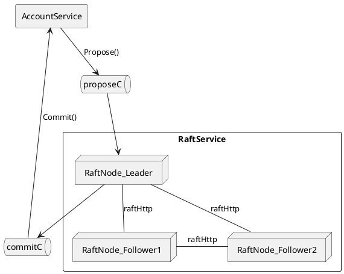

### 4.3.3 Commit Changes
Before committing changes to DB, first `AccountService` asks `GlobalLock Service` to `AcquireLock()`, if success, it will execute the update-command to update the data then return `RPC_MESSAGE_OK` to `Transaction Coordinator`. If failed, it returns `RPC_MESSAGE_FAIL`.

When `Transaction Coordinator` receives the `RPC_MESSAGE_OK` from all `Resoure Managers`, it will execute the `Phase2Commit`, update the transaction status to `COMMITTED` and then call `ReleaseLock()`.

If it receives `RPC_MESSAGE_FAIL`, it will execute the `Phase2Rollback`, update the transaction status to `ABORTED` and then call `ReleaseLock()`.
### 4.4 Data Access Objects (DAO)
`DAO` objects are located in `./dao` directory. Including `AccountDAO`, `PaymentDAO` and `TxnDAO`

```
type AccountDAO interface {
	GetAccount(accountNumber string) *model.AccountInfo
	CreateAccount(accInfo model.AccountInfo) bool
	UpdateAccountBalance(accountNumber string, amount float64) bool
}
```

```
type PaymentDAO interface {
	CreatePayment(pmInfo PaymentInfo) string
}

```

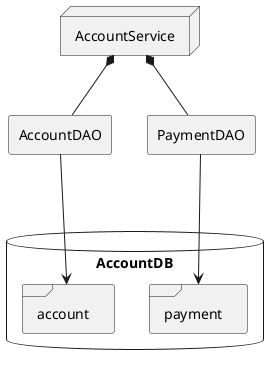

TC uses TxnCoordinatorDAO to operate with Redis:
```
type TxnCoordinatorDAO interface {
	GetMaxId() string
	IncrMaxId() int64
	GetPeersList() map[string]string
	CreateTransactionEntry(string, int64, string, string)
	CreateSubTransactionEntry(string, string, model.Instruction, string)
	CheckLock(lockId string) (int64, error)
	CreateLock(lockId string, state string, timeout time.Duration) (bool, error)
	RefreshLock(lockId string, timeout time.Duration) (bool, error)
	DeleteLock(lockId string) (int64, error)
	GetPeerBucket(id string) string
	InsertPeerBucket(id string, peer string)
}
```

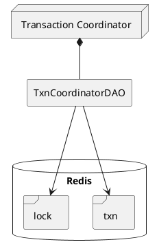
## Starting servers:
### Start Transaction Manager:
Starting Transaction Coordinator & Global Lock Service using goreman, define the Procfile1 with following content:
```
tc-1: go run main.go --mode tc
```
Then execute the file with command:
```
goreman -f Procfile1 start
```
### Start Resource Manager:
Start Resource Manager along with Raft Service using goreman, define Procfile2 with the content, this will create 3 processes, each for one single-node raft-group:
```
# Start 3 Single-node cluster
raftgroup1-1: go run main.go --mode rm --clusterid 1 --id 1 --cluster http://127.0.0.1:12379 --port :50041 --db mas1
raftgroup2-1: go run main.go --mode rm --clusterid 2 --id 1 --cluster http://127.0.0.1:22379 --port :50051 --db mas2
raftgroup3-1: go run main.go --mode rm --clusterid 3 --id 1 --cluster http://127.0.0.1:32379 --port :50061 --db mas3
```

Then execute the file with command:

```
goreman -f Procfile2 start
```

### Add RM to cluster


Hiện tại, khi add thêm Resource Manager vào, cần phải thông báo cho TC để TC update lại peer list.

Khi add thêm RM vào cluster, sẽ có 2 trường hợp xảy ra:
- RM đó chỉ join existing Raft group
  - Ta cần thêm tham số `--clusterid` và `--id` và `--cluster` và `--join` để xác định raft group cần join vào. Tham số `--db mas3` có nghĩa dữ liệu replica này sẽ được lưu ở db của node 3 (mas3).
  	```
	go run main.go --mode rm --clusterid 1 --id 2 --cluster http://127.0.0.1:12379,http://127.0.0.1:12379 --join --port :50042 --db mas3
	```
  - Mọi chuyện trông đơn giản nếu như không có trường hợp thứ 2.

- RM introduces 1 raft group hoàn toàn mới, trong trường hợp này có 2 options:
  - Dữ liêu mới sẽ được insert vào đồng đều trên cả RM cũ lẫn mới.
  - Dữ liệu cần được rebalance lại cho phù hợp với số lượng bucket cũng như số lượng replica. Xem [Appendix B: TODO: Redistribute (rebalance) Data khi add node](#appendix-b-todo-redistribute-rebalance-data-khi-add-node)

	```
	go run main.go --mode rm --clusterid 1 --id 2 --cluster http://127.0.0.1:12379,http://127.0.0.1:12379 --join --port :50042 --db mas3
	```
## 4.5 Workflows
### 4.4.1 Create Account
When TC receive a create request from user with AccountInvfo:
```
type AccountInfo struct {
	Id      string
	Number  string
	Balance float64
}
```
### 4.5.2 Create Payment
When TC receive a payment request from user with PaymentInfo:
```
type PaymentInfo struct {
	Id     string
	From   string
	To     string
	Amount float64
}
```
TC will create a `GlobalTransaction` object with 2 `LocalTransaction` objects, one to update balance of `Sender` and one to update `Receiver`. Workflow as in the following section.

## Commit case:
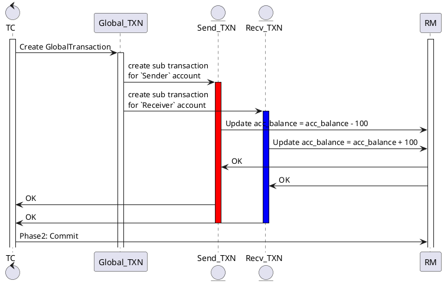

## Rollback case:
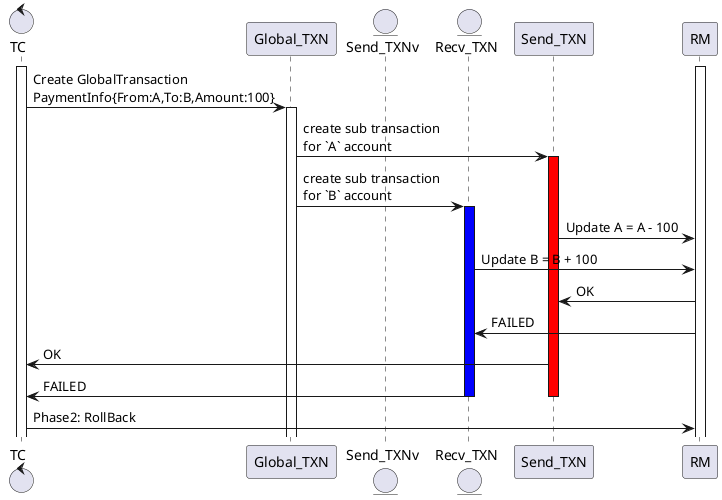

## Write Locking
Trường hợp 2 local transaction cùng update dữ liệu A = A - 100:
### Trường hợp commit

### Trường hợp rollback
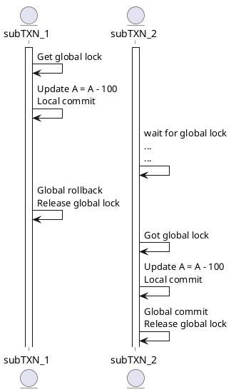

## Read Locking
Hiện tại Read không lock record. Nên khi đọc dữ liệu có thể đọc dirty-read dữ liệu chưa được COMMIT:

### Read-Uncommitted
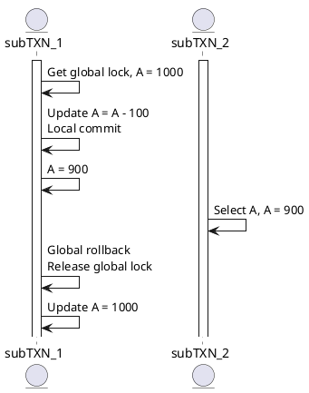

# 5. API Authentication
Go requires gRPC to have TLS (Transport Layer Security or SSL) to be enabled first before using JWT credentials.

## 5.1 TLS
To enable TLS we first need to create a self-signed SSL certificate. 

1. Create private key

	```
	$ openssl genrsa -out cert/server.key 2048
	```
2. Create and sign certificate for `localhost`:
   
   ```
	 $ openssl req -new -x509 -sha256 -key cert/server.key -out cert/server.crt -days 3650 -subj '/CN=localhost'
	 ```

## 5.2 JWT
Get the library by running this command:
```
go get github.com/dgrijalva/jwt-go
```

To sign and verify token:
```
echo {\"foo\":\"bar\"} | jwt -key ./secret_key -alg HS256 -sign - | jwt -key ./secret_key -alg HS256 -verify -
```

For simple, we use `HS256` with symetric `secret_key`, for both sign and verify, but we can use another asymetric public/private key pair using `RSA` or `ECDSA`.

First, we will sign the information using the above command, output is stored in the `token.jwt` file.

On client side, when client sends a request to server, it will get the token file above:
```
token, err := credentials.NewTokenFromFile(client.apiToken)
```
and the server certificate that was created in [5.1](#51-tls):
```
creds, err := grpc_creds.NewClientTLSFromFile(client.apiCert, "")
```
and includes in the credentials in the header:
```
conn, err := grpc.Dial(client.serverAddress,
		grpc.WithTransportCredentials(creds),
		grpc.WithPerRPCCredentials(token))
```

## 5.3 Enable TLS and JWT in Server
On server side, first we need to includ the server certificate and its private key.

```
creds, err := grpc_creds.NewServerTLSFromFile(credentials.SSL_SERVER_CERT, credentials.SSL_SERVER_PRIVATE_KEY)
if err != nil {
	log.Fatalf("Cannot get credentials: %v", err)
}

s := grpc.NewServer(grpc.UnaryInterceptor(credentials.JWTServerInterceptor), grpc.Creds(creds))
```
We also define a interceptor `JWTServerInterceptor` to validate the token.

Right now, for simple we just validate the token at the TC Server where it handles requests from client.

## 5.4 Make a request to TC
Install the `mas_client` cmd:
```
$ go install mas_client/mas_client.go
```
Usage of `mas_client`:
```
$ mas_client --help
Usage of mas_client:
  -amount float
    	Amount of money for Payment
  -balance float
    	Account balance
  -cert string
    	Path to Server certificate (default "./credentials/cert/server.crt")
  -createAcc
    	createAcc/createPmt
  -createPmt
    	createAcc/createPmt
  -from string
    	From Account number of Payment
  -number string
    	Account number
  -tc string
    	TC_SERVICE_HOST (default "localhost:9008")
  -to string
    	To Account number of Payment
  -token string
    	Path to JWT token file (default "./credentials/token.jwt")
```

We can make request to TC using the given token and TSL certificate:
```
$  mas_client --createAcc --number "abc"\
> --token "/path/to/token.jwt"\
>  --cert "/path/to/server.crt"
```

## 5.4 Register JWT Token for new account
Each account when registered will be generated with a JWT token which contain the account info, when authenticate, if all info is correct then the transaction will begin otherwise return an authentication error.

# 6. Deployment
Use Docker compose to build image and create containers:
```
$ docker-compose up --build
```

After that we will have 3 resource manager and 1 transaction coordinator containers.
- Attach shell to `mas-tc` container and execute below command to start TC services:
```
goreman -f Procfile2 start
```
- Attach shell to `mas-rm-*` containers and execute below command to start RM services:
```
goreman start
```

If we want to create own containers and services, we can build the image by executing the `$ ./build.sh` to build the image then run your cluster by creating containers.

## Các vấn đề chưa, sẽ giải quyết
- Hiện tại chỉ hỗ trợ 1 `Transaction Manager`, trong tương lai có thể add thêm TM để tạo thành cluster và dùng Raft để sync data trên các TM đó.
- Hiện tại chỉ lock resource khi write, khi read dữ liệu có thể bị trường hợp đọc dữ liệu chưa được commit. (`READ UNCOMMITTED`). Có thể nâng cấp lên thành `READ COMMITTED`. Khi đó cần phải hiện thực shared-lock cho Read statement.
- Hiện tại, 1 transaction sẽ get global lock trước rồi mới bắt đầu local lock rồi local commit, nhưng để tăng performance, có thể làm giống [Fescar AT](https://github.com/fescar-group/awesome-fescar/blob/master/wiki/en-us/Fescar-AT.md) đó là local lock -> global lock -> local commit -> global commit. Như vậy nếu trường hợp có 2 transaction cùng update 1 dữ liệu thì sẽ nhanh hơn, nhưng cũng sẽ có trường hợp bị chờ deadlock.
- Account Service cần được thực hiện async, tức là trả về kết quả phase 1 ngay khi propose xong, không đợi đến bước apply change to state machine. Sau đó TC gửi request Commit, thì Account Service mới bắt đầu xin global lock và commit. Tương tự với trường hợp Rollback.
- Hiện tại chưa hỗ trợ việc undo, redo log khi TC mất điện. Có nghĩa là chỉ hỗ trợ undo nếu có 1 giao dịch fail, TC vẫn hoạt động bình thường, nếu như TC chưa kịp commit giao dịch mà bị mất điện thì khi start lên lại, TC phải thực hiện crash recovery, scan log xem có giao dịch nào chưa commit thì sẽ `undo`, còn giao dịch nào đã commit nhưng chưa write xuống DB sẽ đuợc `redo`
- Multi-raft config change rebalance dvata -> hiện tại chưa hỗ trợ việc redistribute lại data khi add thêm Raft-group vào Multi-raft.
- Thay vì distribute data theo maxId, có thể dùng Nginx để làm reverse proxy và load balancer.
- Benchmark using Locust
	- Performance: Số lượng node của raft group ảnh hưởng đến thời gian chạy, càng nhiều node thời gian consensus càng lâu.
## Known issues:
- Raft đang gặp performance issue khi test trên 10000 users, khi append log thì hàm này chạy khá chậm. Do có mutex lock lại để đảm bảo thứ tự nên gây ra vấn đề chậm.
  - Khi bỏ dòng này ra thì tốc độ cải thiện khoảng x3 ~ 4 lần, tức khoảng 1800 requests/s
## Tài liệu tham khảo:
1. https://en.wikipedia.org/wiki/Isolation_(database_systems)
2. https://en.wikipedia.org/wiki/Two-phase_commit_protocol
3. https://en.wikipedia.org/wiki/Distributed_algorithm
4. https://github.com/fescar-group/fescar-awesome/blob/master/wiki/en-us/Fescar-AT.md
5. https://godoc.org/github.com/coreos/etcd/raft
6. http://thesecretlivesofdata.com/raft/
7. https://ramcloud.stanford.edu/~ongaro/thesis.pdf
8. http://blog.thislongrun.com/2015/03/the-confusing-cap-and-acid-wording.html

## Appendix A: Raft cluster configuration
Theo minh hoạ, Raft cần phải có số node là 2F + 1 (F là số node tối đa có thể fail), để đảm bảo đồng thuận luôn thành công và tránh trường hợp split-brain.

## Appendix B: TODO: Redistribute (rebalance) Data khi add/remove node

## Install RocksDB on MacOS
- Install Homebrew sau đó chạy command:
```
$ brew install rocksdb
```
Xem trong stdout có xuất ra đường dẫn đến rocksdb, trong trường hợp này là: "/usr/local/Cellar/rocksdb/5.18.3"
- Tiếp tục chạy command như sau:v
```
$ CGO_CFLAGS="-I/usr/local/Cellar/rocksdb/5.18.3/include"
$ CGO_LDFLAGS="-L/usr/local/Cellar/rocksdb/5.18.3 -lrocksdb -lstdc++ -lm -lz -lbz2 -lsnappy -llz4 -lzstd"
$ go get github.com/tecbot/gorocksdb
```

## Making Dockerfile
To build a docker image including the compiled code and libraries, we need to create a Dockerfile which includes:
- Golang base image
- Install rocksdb and dependencies
- Copy code from current project to image and build